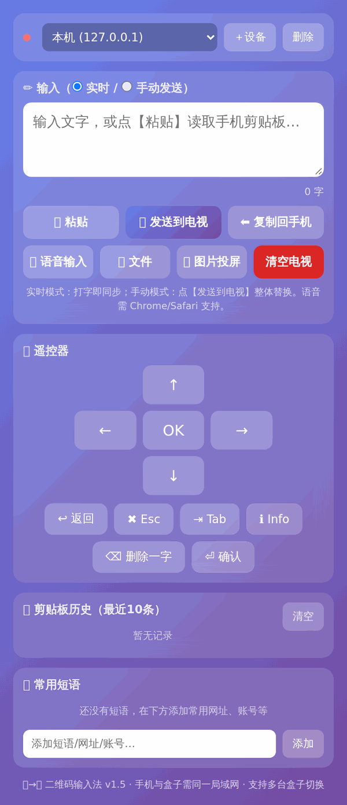
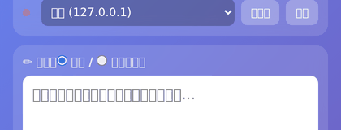

# 二维码输入法 v1.5 (QR Input IME)

**[English](README.en.md) · 中文**

Android 输入法应用：**手机 ↔ 电视盒子 局域网联动输入**。
手机扫二维码 / 打开控制台，即可把文字、文件、图片实时发到电视，还能当遥控器用。

> 包名：`com.qrinput.ime` ｜ 版本：v1.5 ｜ 大小：约 3.7 MB

## 📸 预览





## ✨ 功能

| 分类 | 功能 |
|---|---|
| ⌨️ 输入 | 实时模式（打字即同步，增量 diff 发送）、手动模式（一键整体替换）、删除/清空/确认 |
| 🎮 遥控 | 方向键 + OK / 返回 / Esc / Tab / Info / 删除一字 / 回车 |
| 📜 剪贴板 | 手机剪贴板粘贴发送、电视端选中文本复制回手机、最近 10 条历史 |
| ⭐ 常用短语 | 自定义短语/网址/账号，一键填入 |
| 🎤 语音输入 | 基于 Web Speech API（需 Chrome/Safari），zh-CN 识别 |
| 📄 文件 | txt / json / srt / m3u / xml / conf 等文本文件直接发到电视 |
| 🖼 图片投屏 | 图片缩放至 ≤1920px 后以 JPEG 投到电视 |
| 📺 多设备 | 添加多台盒子（默认端口 8765），下拉切换，在线状态轮询 |

## 📲 安装

1. 将 `二维码输入法-v1.5.apk` 安装到 **Android 电视盒子 / 电视**（支持 Android 系统的盒子即可）；
2. 系统设置 → 语言与输入法 → 启用「二维码输入法」；
3. 电视上显示配对二维码（控制台地址）；
4. **手机无需安装任何 App**，扫码后用浏览器打开控制台即可打字、遥控。

> 服务端由 APK 内置（NanoHTTPD，端口 8765），开箱即用，无需额外部署。

## 🔌 内置服务端 API（端口 8765）

APK 内置 HTTP 服务端，控制台页面与以下 REST 接口均由它提供（手机和盒子需同网段）：

| 方法 | 路径 | 说明 |
|---|---|---|
| GET | `/api/status` | 设备在线状态 `{connected: bool}` |
| POST | `/api/sync` | 全文同步（整体替换电视输入框） |
| POST | `/api/input` | 追加输入文本 |
| POST | `/api/delete` | 删除一个字符 |
| POST | `/api/clear` | 清空电视输入框 |
| POST | `/api/enter` | 回车确认 |
| POST | `/api/key` | 按键（up/down/left/right/ok/back/esc/tab/info） |
| GET | `/api/selection` | 读取电视端选中文本 |
| POST | `/api/image` | 图片投屏 `{data: "data:image/jpeg;base64,..."}` |

## 🛠 自托管控制台（可选）

`assets/input.html` 为 APK 内置控制台页面源码（纯 HTML+JS，无任何依赖），默认由 APK 自带的服务端直接提供。
若想自定义，可在任意静态服务器托管该文件，浏览器打开后在「添加设备」里填入盒子 IP 即可（默认端口 8765）。

## 📄 License

[MIT](LICENSE) © minshurui — 可自由使用、修改、分发（含商用），需保留版权声明。

## 📁 仓库结构

```
.
├── 二维码输入法-v1.5.apk   # 安装包
├── assets/
│   └── input.html          # 内置控制台源码（可自托管）
└── README.md
```
